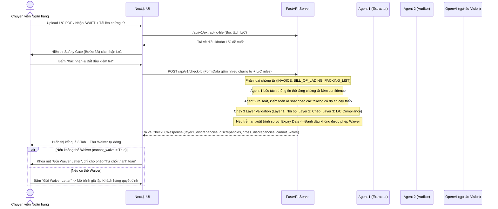

# 🏗️ Kiến trúc Hệ thống LC-Vision v2.0

Tài liệu này mô tả chi tiết kiến trúc kỹ thuật của hệ thống kiểm tra chứng từ L/C bằng công nghệ AI đa phương thức (Vision), luồng xử lý dữ liệu kiểm toán đa tác nhân trên nhiều tài liệu cùng lúc và cấu trúc thư mục dự án thực tế.

---

## 1. Tổng quan Kiến trúc (Decoupled Architecture)

Hệ thống áp dụng mô hình phân tách độc lập (Frontend và Backend) nhằm tối ưu hóa thế mạnh của từng công nghệ:

```
┌─────────────────────────────────┐        ┌─────────────────────────────────┐
│     Next.js 16 (Port 3000)      │ ◄────► │      FastAPI (Port 8000)        │
│   - React 19 Client UI          │  HTTP  │   - Python 3.11 Backend Server  │
│   - 3-Layer Validation Tabs     │        │   - PyMuPDF (PDF to Image)      │
│   - Real-time Recheck (HITL)    │        │   - Multi-Document Extractor    │
│   - Expiry Waiver Block         │        │   - Multi-Agent AI (GPT-4o)     │
└─────────────────────────────────┘        └─────────────────────────────────┘
```

*   **Frontend (Next.js 16 + TypeScript + Tailwind CSS):** Giao diện chuyên nghiệp, hỗ trợ kéo thả upload nhiều chứng từ (Invoice, Bill of Lading, Packing List), bước Safety Gate duyệt điều khoản L/C, màn hình kết quả 3 Tab (Layer 1: Nội bộ, Layer 2: Đối chiếu chéo, Layer 3: So khớp L/C), và giả lập chấp nhận/từ chối Waiver của Khách hàng.
*   **Backend (FastAPI + Pydantic + SQLite + Uvicorn):** Quét tìm trang chứng từ tối ưu, render ảnh JPEG base64 qua `PyMuPDF` (fitz), chạy song song bóc tách đa chứng từ qua Agent 1 (Extractor) và Agent 2 (Auditor). Thực hiện thuật toán thẩm định 3 Layer và tính toán cờ chặn Waiver tuyệt đối nếu L/C trễ hạn.

---

## 2. Sơ đồ Luồng dữ liệu Đa Tác Nhân (Multi-Agent Flow)



---

## 3. Các Layer Thẩm Định & Đối Chiếu Dữ Liệu
Hệ thống LC-Vision v2.0 thực hiện rà soát nghiêm ngặt qua 3 tầng nghiệp vụ:
1. **Layer 1 (Internal Validation):** Kiểm tra nội bộ từng chứng từ (Invoice Number/Date có trống không, đơn giá x số lượng có khớp tổng tiền không, B/L có chữ ký và ghi chú Clean on Board không, Packing List có trọng lượng và số kiện hợp lệ không).
2. **Layer 2 (Cross-Document Consistency):** Đối chiếu chéo giữa các chứng từ (Tên Shipper B/L khớp Beneficiary Invoice, Mô tả hàng hóa khớp, Số lượng khớp, B/L On-Board Date <= Invoice Date, Số kiện và Trọng lượng B/L khớp Packing List).
3. **Layer 3 (L/C Compliance):** So khớp chứng từ với điều khoản L/C (So khớp tên Beneficiary/Applicant, Hạn mức số tiền kèm dung sai ±10% hoặc ±5%, Loại tiền tệ, Ngày giao hàng, Cảng xếp/dỡ, Incoterms, cấm giao hàng từng phần, cấm chuyển tải, Ngày xuất trình so với Ngày hết hạn L/C).

---

## 4. Chi tiết Cấu trúc Thư mục Dự án

```text
LC/
├── backend/
│   ├── app/
│   │   ├── database.py      # SQLite Audit Trail Database
│   │   ├── main.py          # REST Endpoints (/check-lc, /extract-lc-file, /parse-swift...)
│   │   ├── schemas.py       # Định nghĩa Pydantic Models (ExtractedDocument, BLExtracted, PLExtracted...)
│   │   ├── services.py      # Quy tắc thẩm định 3 Layer, Agent 1 & Agent 2, bóc tách Vision
│   │   └── swift_parser.py  # Phân tích cú pháp điện thô SWIFT MT700 sang L/C terms
│   ├── auto_test.py         # Script chạy kiểm thử tự động toàn bộ luồng
│   └── requirements.txt     # Dependencies
├── frontend/
│   ├── src/
│   │   └── app/
│   │       ├── globals.css  # Styling hệ thống
│   │       └── page.tsx     # Giao diện Next.js, HITL và Trình giả lập Khách hàng
│   ├── Dockerfile
│   └── package.json
├── docker-compose.yml       # Docker Composer điều phối
├── Architecture.md          # Tài liệu kiến trúc này
├── flowdemo.md              # Kịch bản chạy thử demo
└── readme.md                # Tài liệu hướng dẫn sử dụng chính
```