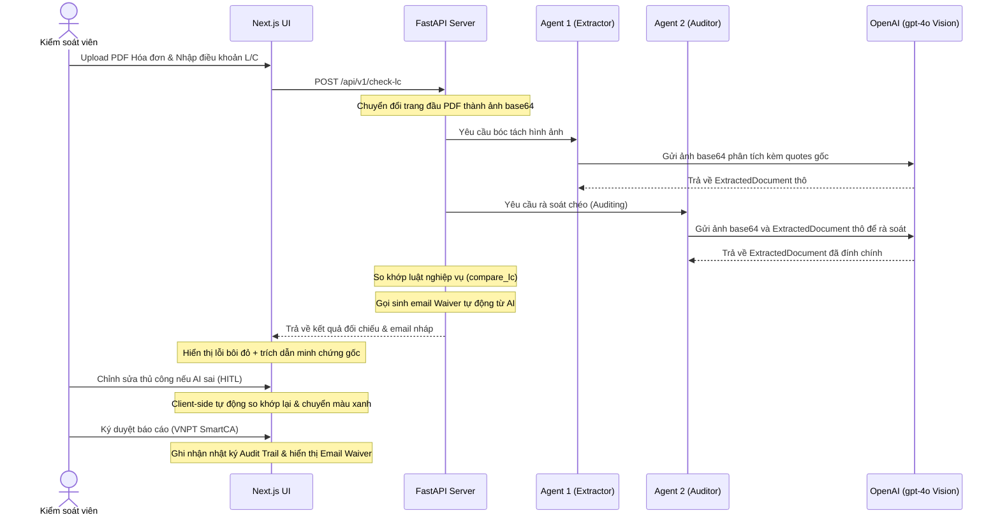

# 🏗️ Kiến trúc Hệ thống LC-Vision

Tài liệu này mô tả chi tiết kiến trúc kỹ thuật của hệ thống kiểm tra chứng từ L/C, luồng xử lý dữ liệu hình ảnh nâng cao và chiến lược tích hợp AI.

## 1. Tổng quan Kiến trúc (Decoupled Architecture)
Hệ thống áp dụng kiến trúc phân tách hoàn toàn giữa Frontend và Backend để tối ưu hóa đặc thù của từng ngôn ngữ/môi trường:
- **Frontend:** Next.js 16 + TypeScript + Tailwind CSS (chạy Webpack để đảm bảo tương thích đường dẫn chứa tiếng Việt trên Windows). Đảm nhiệm giao diện tương tác, sửa đổi trực tiếp dữ liệu (HITL), ký duyệt và Audit Trail.
- **Backend & AI Engine:** Python + FastAPI + Pydantic. Đảm nhận việc render trang PDF thành hình ảnh JPG base64 bằng `PyMuPDF` và điều phối luồng Multi-Agent thông qua OpenAI Vision SDK.

---

## 2. Sơ đồ Luồng dữ liệu & Multi-Agent Flow (Vision-based)



---

## 3. Cấu trúc Schema cốt lõi (Pydantic)
Sức mạnh bóc tách của hệ thống dựa trên việc bắt buộc OpenAI trả về kiểu dữ liệu có cấu trúc định sẵn kèm trích dẫn gốc (`_quote`) để làm bằng chứng:

```python
class ExtractedDocument(BaseModel):
    invoice_number: str
    invoice_number_quote: str
    total_amount: float
    total_amount_quote: str
    currency: str
    currency_quote: str
    shipment_date: str  # Format: YYYY-MM-DD
    shipment_date_quote: str
    port_of_loading: str
    port_of_loading_quote: str
    beneficiary_name: str
    beneficiary_name_quote: str
```

---

## 🚀 Hướng dẫn cài đặt & Chạy Local (Không qua Docker)

### 1. Khởi động Backend (Python)
```bash
cd backend
python -m venv venv
# Kích hoạt môi trường ảo (Windows)
.\venv\Scripts\activate

# Cài đặt thư viện
pip install -r requirements.txt

# Thiết lập API Key
$env:OPENAI_API_KEY="sk-proj-xxxxxx..."

# Chạy server
uvicorn app.main:app --reload --port 8000
```

### 2. Khởi động Frontend (Next.js)
```bash
cd frontend
npm install
npm run dev
```
Truy cập giao diện tại `http://localhost:3000`.