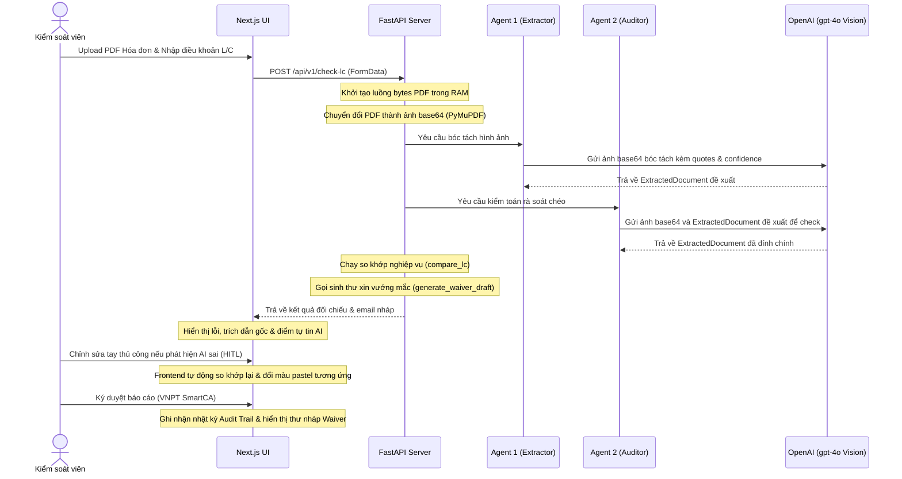

# 🏗️ Kiến trúc Hệ thống LC-Vision

Tài liệu này mô tả chi tiết kiến trúc kỹ thuật của hệ thống kiểm tra chứng từ L/C bằng công nghệ AI đa phương thức (Vision), luồng xử lý dữ liệu kiểm toán đa tác nhân và cấu trúc thư mục dự án thực tế.

---

## 1. Tổng quan Kiến trúc (Decoupled Architecture)

Hệ thống áp dụng mô hình phân tách độc lập (Frontend và Backend) nhằm tối ưu hóa thế mạnh của từng công nghệ:

```
┌─────────────────────────────────┐        ┌─────────────────────────────────┐
│     Next.js 16 (Port 3000)      │ ◄────► │      FastAPI (Port 8000)        │
│   - React 19 Client UI          │  HTTP  │   - Python 3.11 Backend Server  │
│   - Real-time Recheck (HITL)    │        │   - PyMuPDF (PDF to Image)      │
│   - Audit Trail & SmartCA Sign  │        │   - Multi-Agent AI (GPT-4o)     │
└─────────────────────────────────┘        └─────────────────────────────────┘
```

*   **Frontend (Next.js 16 + TypeScript + Tailwind CSS):** Đảm nhiệm vai trò giao diện hiển thị sáng mang phong cách Xanh Navy Ngân hàng, kéo thả upload tài liệu, can thiệp thủ công (HITL) thay đổi giá trị trực tiếp trên bảng, và lưu trữ nhật ký hoạt động (Audit Trail). Chạy trên nền trình biên dịch **Webpack** (qua cờ `--webpack`) để khắc phục lỗi phân tách ký tự tiếng Việt có dấu của Turbopack trên môi trường Windows.
*   **Backend (FastAPI + Pydantic + Uvicorn):** Đảm nhận vai trò xử lý nghiệp vụ, chuyển đổi PDF trực tiếp từ bộ nhớ RAM sang ảnh JPEG base64 qua thư viện `PyMuPDF` (fitz) và điều phối các tác nhân AI độc lập.

---

## 2. Sơ đồ Luồng dữ liệu Đa Tác Nhân (Multi-Agent Flow)



---

## 3. Cấu trúc Schema cốt lõi (Pydantic)
Sự chặt chẽ của dữ liệu bóc tách được quy chuẩn hóa trong file [schemas.py](file:///c:/Users/maitr/OneDrive/Máy tính/LC/backend/app/schemas.py) với các trường giá trị, trích dẫn gốc (`_quote`) và điểm tin cậy tự đánh giá (`_confidence` từ 0.0 đến 1.0):

```python
class ExtractedDocument(BaseModel):
    invoice_number: str
    invoice_number_quote: str
    invoice_number_confidence: float
    
    total_amount: float
    total_amount_quote: str
    total_amount_confidence: float
    
    currency: str
    currency_quote: str
    currency_confidence: float
    
    shipment_date: str  # Format: YYYY-MM-DD
    shipment_date_quote: str
    shipment_date_confidence: float
    
    port_of_loading: str
    port_of_loading_quote: str
    port_of_loading_confidence: float
    
    beneficiary_name: str
    beneficiary_name_quote: str
    beneficiary_name_confidence: float
```

---

## 📂 Chi tiết cấu trúc thư mục dự án

```text
LC/
├── backend/
│   ├── app/
│   │   ├── __init__.py
│   │   ├── main.py          # Route chính tiếp nhận API /api/v1/check-lc
│   │   ├── schemas.py       # Định nghĩa Pydantic Schema cho dữ liệu và lỗi
│   │   └── services.py      # Render PDF thô sang ảnh, luồng Multi-Agent AI
│   ├── .dockerignore        # Bỏ qua venv và pycache khi dựng container
│   ├── Dockerfile           # Đóng gói backend (Python 3.11-slim)
│   └── requirements.txt     # Các dependency backend (fastapi, uvicorn, pymupdf...)
├── frontend/
│   ├── src/
│   │   └── app/
│   │       ├── globals.css  # CSS cấu hình giao diện sáng
│   │       ├── layout.tsx
│   │       └── page.tsx     # Giao diện chính, so khớp client-side và Audit Trail
│   ├── .dockerignore        # Bỏ qua node_modules và .next khi dựng container
│   ├── Dockerfile           # Đóng gói frontend (Node 20-alpine)
│   ├── next.config.ts
│   ├── package.json         # Danh sách thư viện và scripts chạy Webpack
│   └── tsconfig.json
├── .env                     # File chứa mã API Key OpenAI (Được bảo mật bởi Gitignore)
├── .env.example             # File mẫu API Key tham chiếu
├── .gitignore               # Loại bỏ .env và node_modules khỏi Git
├── docker-compose.yml       # Tệp docker compose điều phối cả hệ thống
├── Architecture.md          # Tài liệu kiến trúc này
├── flowdemo.md              # Kịch bản chạy thử hackathon
└── readme.md                # Tài liệu hướng dẫn sử dụng chính
```

---

## 🚀 Hướng dẫn chạy thử dự án trên môi trường Local (Không qua Docker)

### Bước 1: Khởi động Backend (Python)
1. Truy cập thư mục backend và tạo môi trường ảo:
   ```bash
   cd backend
   python -m venv venv
   ```
2. Kích hoạt môi trường ảo (trên Windows):
   ```bash
   .\venv\Scripts\activate
   ```
3. Cài đặt các thư viện cần thiết:
   ```bash
   pip install -r requirements.txt
   ```
4. Thiết lập khóa API OpenAI (PowerShell):
   ```bash
   $env:OPENAI_API_KEY="sk-proj-xxxxxx..."
   ```
5. Chạy dịch vụ FastAPI bằng uvicorn:
   ```bash
   uvicorn app.main:app --reload --port 8000
   ```

### Bước 2: Khởi động Frontend (Next.js)
1. Truy cập thư mục frontend và cài đặt dependencies:
   ```bash
   cd ../frontend
   npm install
   ```
2. Khởi chạy dev server của Next.js (chạy qua Webpack):
   ```bash
   npm run dev
   ```
3. Truy cập địa chỉ `http://localhost:3000` trên trình duyệt để trải nghiệm phần mềm.